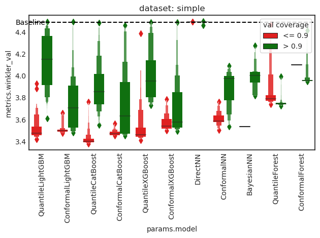
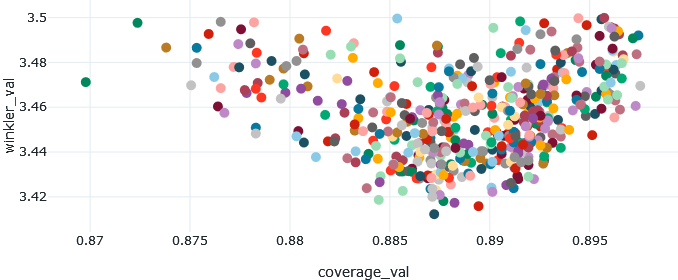
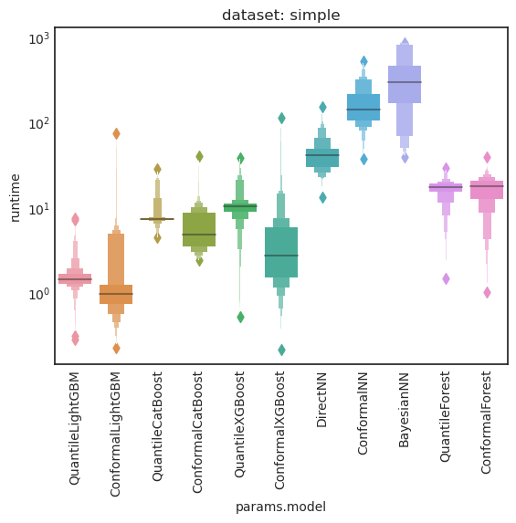

# Report: First set of experiments on dataset `simple`

> **Takeaway:**  
> - Conformal boosting algorithms achieve best valid (coverage < .9) Winkler score
> - Quantile boosting is best overall, but only under invalid coverage ($\approx .89$) $\implies$ New quantile experiments with larger coverage

## Setting
Run all models on the dataset `simple` with 1h runtime per model and model parameter search spaces as in git commit `c494908a28df1f7e99520c957411b2eb23fe82c9`. The search spaces for the prediction strategies are
```yaml
# conformal
coverage:
  value: 0.9

# quantile
lower_percentiles:
  type: categorical
  choices: [[.05], [.03, .05, .07]]
coverage:
  value: .9

# bayes
b_0:
  type: float
  low: .5
  high: 2.0
alpha_0:
  type: float
  low: .5
  high: 2.0
delta_0:
  type: float
  low: .5
  high: 2.0
coverage:
  value: .9
```


## Results
Invalid predictions refer to predictions whose validation coverage is below the threshold .9.

**Winkler interval score**



**Neural networks**
- `ConformalNN` is close to being competitive
- `DirectNN` seems to be bugged, doesn't improve upon intialization
- `BayesianNN` achieves reasonable performance under invalid coverage, otherwise as bad as `random forest`
- 
**Conformal prediction**
- Best valid performance by `boosting` algorithms (all similar), followed by the conformal `NN`. Worst by far is `random forest`
- Invalid predictions mostly occur around the optimal winkler score for each model


**Quantile prediction**

`random forest`
- Better than conformal version, but still not competitive
  
`boosting`
- Achieves best Winkler score overall, but only under invalid coverage
- Invalid results yield much better score than valid ones



- Optimal winkler score achieved at validation coverage $\approx .887$ 
- Increase validation coverage for quantile prediction head and rerun experiments

**Runtime (just some sanity checks)**



- `quantile` takes longer than `conformal`, because multiple models have to be trained (one for each quantile, i.e. 2-6). Surprisingly except for `random forest`, which is about even
- `NN` takes about 2 orders of magnitude longer per run. Except for `DirectNN`, which is probably due to early stopping because the model didn't learn