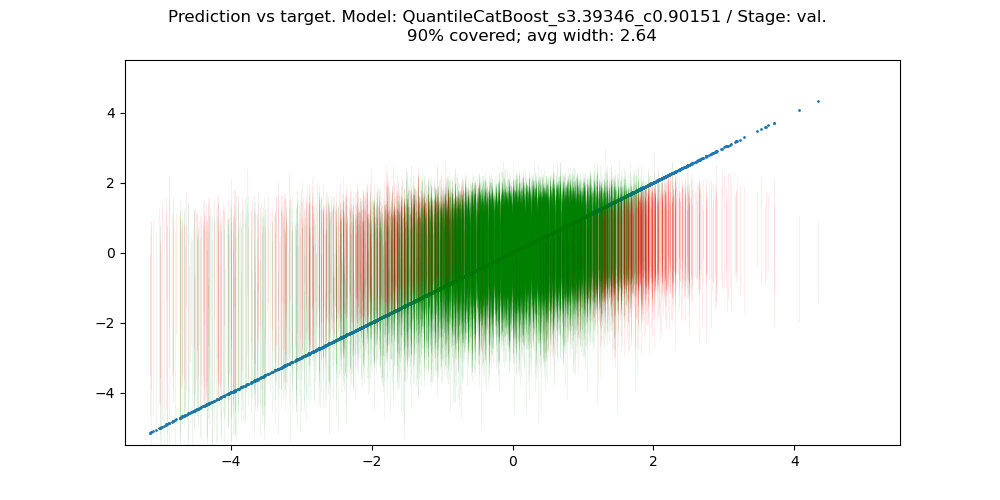

# Report: First set of experiments on dataset `simple`

> **Takeaway:**  
> - With train coverage increased to 91%, quantile boosting now surpasses conformal models by achieving best interval scores under validation coverage > 90%.
> - Quantile models outperform conformal models because they can predict the confidence interval width dependent on the test point.

## Setting
Run `boost` models with `quantile` prediction on the dataset `simple` with 1h runtime per model and model parameter search spaces as in git commit `ff1bc2f988622e2e472adba134e5029b73c64283`. The search spaces for the prediction strategies is now slightly larger (train to learn 91% CI) since previous experiments showed that 90% leads to underprediction on the validation set.
```yaml
# quantile
lower_percentiles:
  type: categorical
  choices: [[.045]]
coverage:
  value: .91
```


## Results


- Gap of Winkler score between valid and invalid solutions is eliminated
- Valid solutions now achieve better Winkler scores than previous best (conformal models)

## Comparison of best solutions: `quantile` vs. `conformal`

Visualizations of the previously optimal `catboost-conformal` prediction model and the now optimal `??-quantile` model on validation data.

**Target vs predicted**



- x-axis shows target, data points are blue, and lines are prediction intervals, colored by whether they contain data point (green) or not (red)
- both conformal and quantile models exhibit similar behavior: they cover the center of the data well, cover part of the left tail, and almost none of the right tail. ($\implies$ larger targets seem to be harder than smaller ones)

**Marginals**


- **Pointwise prediction (left):** both models show similar pointwise prediction performance, which is expected since they both use the same boosting base model
- **Covered datapoints (center):** both models seem to cover most of the central datapoints but not much of the tails
- **Confidence interval width (right):** this shows the reason why quantile models outperform conformal models
  - Conformal models predict a constant interval width because uncertainty is computed over the marginal validation error distribution, independent of new test points
  - Qunatile models predict quantiles and hence the confidence interval width *dependent on the test point*. This allows for contracting the confidence interval for easy test points and extending it for hard ones instead of having to take an average.

